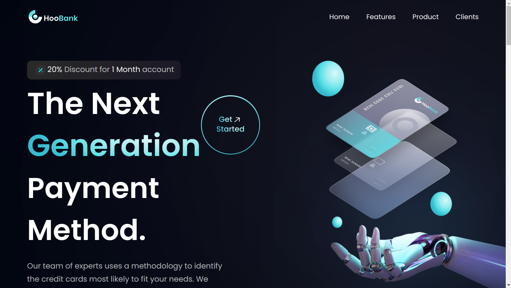

# Projeto de Desenvolvimento Web Moderno com React JS

## Descrição do Projeto

Este é um projeto com foco em design e responsividade. É uma aplicação React responsiva, incorporando uma seção hero impressionante, assets de alta qualidade, estatísticas de negócios, seções de recursos reutilizáveis com botões de call-to-action, depoimentos e muito mais.

## Aprendizados

Durante o projeto, adquiri habilidades em:

- Componentes funcionais React e estrutura de arquivos
- Utilização do Tailwind CSS para estilização
- Manipulação de propriedades CSS, como flexbox e gradientes
- Implementação de media queries
 

## Visualisação do projeto

[Link do projeto](https://modern-landing-page-olive.vercel.app/)

